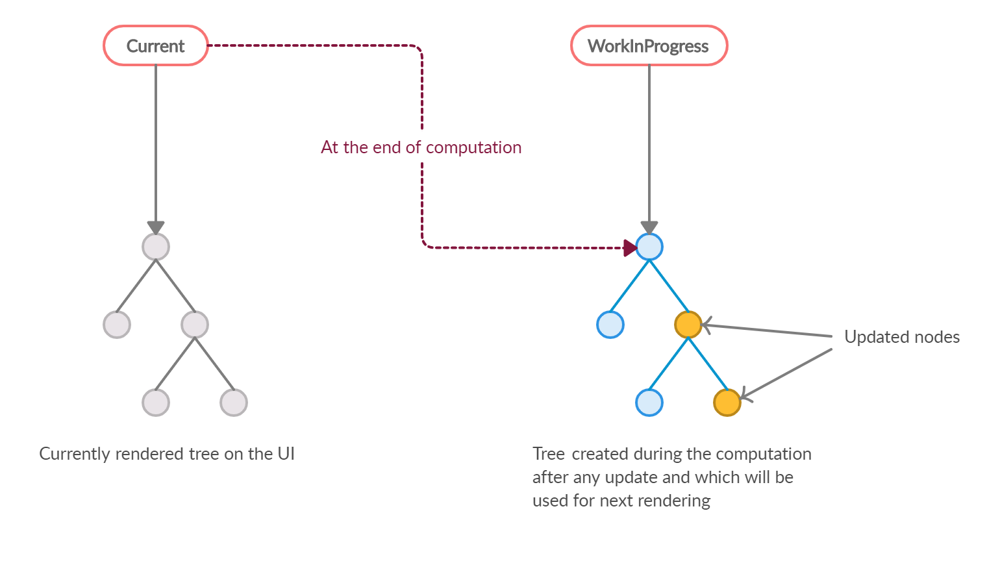
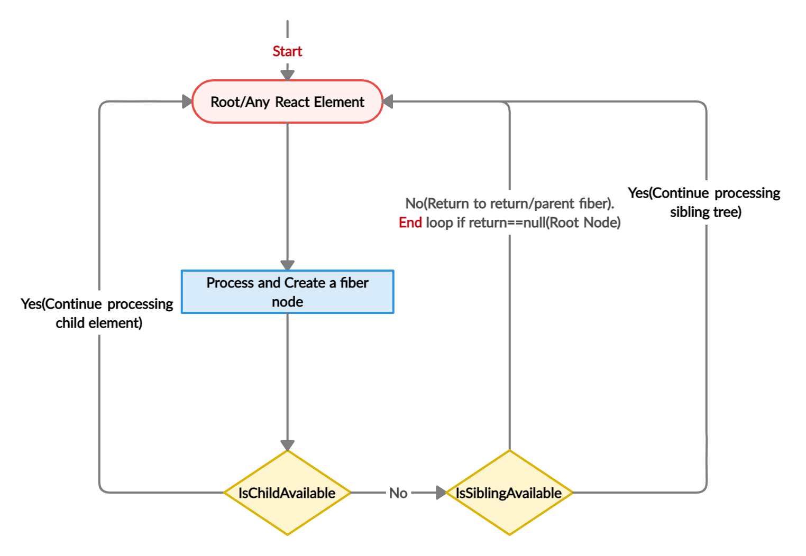
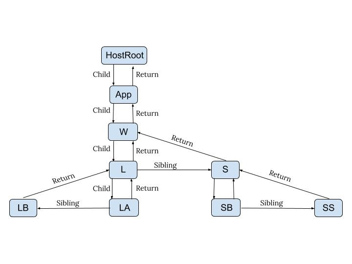

# An Introduction to React Fiber - The Algorithm Behind React

Created: December 21, 2023 5:00 PM
URL: https://www.velotio.com/engineering-blog/react-fiber-algorithm

In this article, we will learn about React Fiber—the core algorithm behind React. React Fiber is the new reconciliation algorithm in React 16. You’ve most likely heard of the _virtualDOM_ from React 15. It’s the old reconciler algorithm (also known as the Stack Reconciler) because it uses stack internally. The same reconciler is shared with different renderers like DOM, Native, and Android view. So, calling it _virtualDOM_ may lead to confusion.

So without any delay, let’s see what React Fiber is.

## Introduction

React Fiber is a completely backward-compatible rewrite of the old reconciler. This new reconciliation algorithm from React is called Fiber Reconciler. The name comes from _fiber_, which it uses to represent the node of the DOM tree. We will go through _fiber_ in detail in later sections.

The main goals of the Fiber reconciler are incremental rendering, better or smoother rendering of UI animations and gestures, and responsiveness of the user interactions. The reconciler also allows you to divide the work into multiple chunks and divide the rendering work over multiple frames. It also adds the ability to define the priority for each unit of work and pause, reuse, and abort the work.

Some other features of React include returning multiple elements from a render function, supporting better error handling(we can use the _componentDidCatch_ method to get clearer error messages), and portals.

While computing new rendering updates, React refers back to the main thread multiple times. As a result, high-priority work can be jumped over low-priority work. React has priorities defined internally for each update.

Before going into technical details, I would recommend you learn the following terms, which will help understand React Fiber.

## Prerequisites

### [Reconciliation](https://reactjs.org/docs/reconciliation.html)

As explained in the official [React documentation](https://reactjs.org/docs/reconciliation.html), _reconciliation_ is the algorithm for diffing two DOM trees. When the UI renders for the first time, React creates a tree of nodes. Every individual node represents the React element. It creates a virtual tree (which is known as _virtualDOM_) that’s a copy of the rendered DOM tree. After any update from the UI, it recursively compares every tree node from two trees. The cumulative changes are then passed to the renderer.

### [Scheduling](https://reactjs.org/docs/design-principles.html#scheduling)

As explained in the [React documentation](https://reactjs.org/docs/design-principles.html#scheduling), suppose we have some low-priority work (like a large computing function or the rendering of recently fetched elements), and some high-priority work (such as animation). There should be an option to prioritize the high-priority work over low-priority work. In the old stack reconciler implementation, recursive traversal and calling the render method of the whole updated tree happens in single flow. This can lead to dropping frames.

Scheduling can be time-based or priority-based. The updates should be scheduled according to the deadline. The high-priority work should be scheduled over low-priority work.

### [requestIdleCallback](https://developers.google.com/web/updates/2015/08/using-requestidlecallback)

_requestAnimationFrame_ schedules the high-priority function to be called before the next animation frame. Similarly, _requestIdleCallback_ schedules the low-priority or non-essential function to be called in the free time at the end of the frame.

```js
requestIdleCallback(lowPriorityWork);
```

This shows the usage of _requestIdleCallback_. _lowPriorityWork_ is a callback function that will be called in the free time at the end of the frame.

```js
function lowPriorityWork(deadline) {
  while (deadline.timeRemaining() > 0 && workList.length > 0)
    performUnitOfWork();

  if (workList.length > 0) requestIdleCallback(lowPriorityWork);
}
```

When this callback function is called, it gets the argument _deadline_ object. As you can see in the snippet above, the _timeRemaining_ function returns the latest idle time remaining. If this time is greater than zero, we can do the work needed. And if the work is not completed, we can schedule it again at the last line for the next frame.

So, now we are good to proceed with how the _fiber_ object itself looks and see how React Fiber works

## Structure of fiber

A _fiber_(lowercase ‘f’) is a simple JavaScript object. It represents the React element or a node of the DOM tree. It’s a unit of work. In comparison, Fiber is the React Fiber reconciler.

This example shows a simple React component that renders in _root_ div.

```js
function App() {
  return (
    <div className="wrapper">
      <div className="list">
        <div className="list_item">List item A</div>
        <div className="list_item">List item B</div>
      </div>
      <div className="section">
        <button>Add</button>
        <span>No. of items: 2</span>
      </div>
    </div>
  );
}

ReactDOM.render(<App />, document.getElementById("root"));
```

It's a simple component that shows a list of items for the data we have got from the component state. (I have replaced the _.map_ and iteration over data with two list items just to make this example look simpler.) There is also a button and the span,which shows the number of list items.

As mentioned earlier, _fiber_ represents the React element. While rendering for the first time, React goes through each of the React elements and creates a tree of fibers. (We will see how it creates this tree in later sections.)

It creates a fiber for each individual React element, like in the example above. It will create a fiber, such as _W_, for the div, which has the class _wrapper_. Then, fiber L for the div, which has a class _list_, and so on. Let’s name the fibers for two list items as _LA_ and _LB_.

In the later section, we will see how it iterates and the final structure of the tree. **Though we call it a tree, React Fiber creates a linked list of nodes where each node is a fiber.** And there is a relationship between parent, child, and siblings. React uses a _return_ key to point to the parent node, where any of the children fiber should return after completion of work. So, in the above example, _LA's_ return is _L_, and the sibling is _LB_.

## How does React Fiber work?

Next, we will see how the React Fiber creates the linked list tree and what it does when there is an update.

Before that, let’s explain what a _current_ tree and _workInProgress_ tree is and how the tree traversal happens.

The tree, which is currently flushed to render the UI, is called _current_. It’s one that was used to render the current UI. Whenever there is an update, Fiber builds a _workInProgress_ tree, which is created from the updated data from the React elements. React performs work on this _workInProgress_ tree and uses this updated tree for the next render. Once this _workInProgress_ tree is rendered on the UI, it becomes the _current_ tree.



Fig:- Current and workInProgress trees

‍

Fiber tree traversal happens like this:

- Start: Fiber starts traversal from the topmost React element and creates a fiber node for it.
- Child: Then, it goes to the child element and creates a fiber node for this element. This continues until the leaf element is reached.
- Sibling: Now, it checks for the sibling element if there is any. If there is any sibling, it traverses the sibling subtree until the leaf element of the sibling.
- Return: If there is no sibling, then it returns to the parent.

Every fiber has a child (or a null value if there is no child), sibling, and parent property (as you have seen the structure of fiber in the earlier section). These are the pointers in the Fiber to work as a linked list.


Fig:- React Fiber tree traversal

‍

Let’s take the same example, but let’s name the fibers that correspond to the specific React elements.

```js
function App() {
  // App
  return (
    <div className="wrapper">
      {" "}
      // W<div className="list">
        {" "}
        // L<div className="list_item">List item A</div> // LA
        <div className="list_item">List item B</div> // LB
      </div>
      <div className="section">
        {" "}
        // S<button>Add</button> // SB
        <span>No. of items: 2</span> // SS
      </div>
    </div>
  );
}

ReactDOM.render(<App />, document.getElementById("root")); // HostRoot
```

First, we will quickly cover the mounting stage where the tree is created, and after that, we will see the detailed logic behind what happens after any update.

### **Initial render**

The App component is rendered in root div, which has the id of _root_.

Before traversing further, React Fiber creates a root fiber. Every Fiber tree has one root node. Here in our case, it’s _HostRoot_. There can be multiple roots if we import multiple React Apps in the DOM.

Before rendering for the first time, there won’t be any tree. React Fiber traverses through the output from each component’s render function and creates a fiber node in the tree for each React element. It uses _[createFiberFromTypeAndProps](https://github.com/facebook/react/blob/769b1f270e1251d9dbdce0fcbd9e92e502d059b8/packages/react-reconciler/src/ReactFiber.js#L414)_ to convert React elements to fiber. The React element can be a class component or a host component like div or span. For the class component, it creates an instance, and for the host component, it gets the data/props from the React Element.

So, as shown in the example, it creates a fiber _App_. Going further, it creates one more fiber, _W_, and then it goes to child div and creates a fiber L. So on, it creates a fiber, _LA_ and _LB_, for its children. The fiber, _LA_, will have return (can also be called as a parent in this case) fiber as _L_, and sibling as _LB_.

So, this is how the final fiber tree will look.

‍

This is how the nodes of a tree are connected using the child, sibling, and return pointers.

### **Update Phase**

Now, let’s cover the second case, which is update—say due to setState.

So, at this time, Fiber already has the _current_ tree. For every update, it builds a _workInProgress_ tree. It starts with the root fiber and traverses the tree until the leaf node. Unlike the initial render phase, it doesn’t create a new fiber for every React element. It just uses the preexisting fiber for that React element and merges the new data/props from the updated element in the update phase.

Earlier, in React 15, the stack reconciler was synchronous. So, an update would traverse the whole tree recursively and make a copy of the tree. Suppose in between this, if some other update comes that has a higher priority than this, then there is no chance to abort or pause the first update and perform the second update.

React Fiber divides the update into units of works. It can assign the priority to each unit of work, and has the ability to pause, reuse, or abort the unit of work if not needed. React Fiber divides the work into multiple units of work, which is fiber. It schedules the work in multiple frames and uses the _deadline_ from the _requestIdleCallback_. Every update has its priority defined like animation, or user input has a higher priority than rendering the list of items from the fetched data. Fiber uses _requestAnimationFrame_ for higher priority updates and _requestIdleCallback_ for lower priority updates. So, while scheduling a work, Fiber checks the priority of the current update and the _deadline_ (free time after the end of the frame).

Fiber can schedule multiple units of work after a single frame if the priority is higher than the pending work—or if there is no _deadline_ or the deadline has yet to be reached. And the next set of units of work is carried over the further frames. This is what makes it possible for Fiber to pause, reuse, and abort the unit of work.

So, let’s see what actually happens in the scheduled work. There are two phases to complete the work: _render_ and _commit_.

### Render Phase

The actual tree traversal and the use of _deadline_ happens in this phase. This is the internal logic of Fiber, so the changes made on the Fiber tree in this phase won’t be visible to the user. So Fiber can pause, abort, or divide work on multiple frames.

We can call this phase the reconciliation phase. Fiber traverses from the root of the fiber tree and processes each fiber. The _[workLoop](https://github.com/facebook/react/blob/f765f022534958bcf49120bf23bc1aa665e8f651/packages/react-reconciler/src/ReactFiberScheduler.js#L1136)_ function is called for every unit of work to perform the work. We can divide this processing of the work into two steps: _begin_ and _complete_.

### **Begin Step**

If you find the _[workLoop](https://github.com/facebook/react/blob/f765f022534958bcf49120bf23bc1aa665e8f651/packages/react-reconciler/src/ReactFiberScheduler.js#L1136)_ function from the React codebase, it calls the _performUnitOfWork_, which takes the _nextUnitOfWork_ as a parameter. It is nothing but the unit of work, which will be performed. The _performUnitOfWork_ function internally calls the _beginWork_ function. This is where the actual work happens on the fiber, and _performUnitOfWork_ is just where the iteration happens.

Inside the _[beginWork](https://github.com/facebook/react/blob/f765f022534958bcf49120bf23bc1aa665e8f651/packages/react-reconciler/src/ReactFiberBeginWork.js#L1076)_ function, if the fiber doesn’t have any pending work, it just bails out(skips) the fiber without entering the begin phase. This is how, while traversing the large tree, Fiber skips already processed fibers and directly jumps to the fiber, which has pending work. If you see the large _beginWork_ function code block, we will find a switch block that calls the respective fiber update function, depending on the fiber tag. Like _updateHostComponent_ for host components. These functions update the fiber.

The _beginWork_ function returns the child fiber if there is any or null if there is no child. The _performUnitOfWork_ function keeps on iterative and calls the child fibers till the leaf node reaches. In the case of a leaf node, _beginWork_ returns null as there is no any child and _performUnitOfWork_ function calls a _completeUnitOfWork_ function. Let’s see the complete step now.

### **Complete Step**

This _completeUnitOfWork_ function completes the current unit of work by calling a _completeWork_ function. _completeUnitOfWork_ returns a sibling fiber if there is any to perform the next unit of work else completes the return(parent) fiber if there is no work on it. This goes till the return is null, i.e., until it reaches the root node. Like _beginWork_, _completeWork_ is also a function where actual work happens, and _completeUnitOfWork_ is for the iterations.

The result of the render phase creates an effect list (side-effects). These effects are like insert, update, or delete a node of host components, or calling the lifecycle methods for the node of class components. The fibers are marked with the respective effect tag.

After the render phase, Fiber will be ready to commit the updates.

### Commit Phase

This is the phase where the finished work will be used to render it on the UI. As the result of this phase will be visible to the user, it can’t be divided in partial renders. This phase is a synchronous phase.

At the beginning of this phase, Fiber has the _current_ tree that’s already rendered on the UI, _finishedWork_, or the _workInProgress_ tree, which is built during the render phase and the effect list.

The effect list is the linked list of fibers, which has side-effects. So, it’s a subset of nodes of the _workInProgress_ tree from the render phase, which has side-effects(updates). The effect list nodes are linked using a _nextEffect_ pointer.

The function called during this phase is _[completeRoot](https://github.com/facebook/react/blob/95a313ec0b957f71798a69d8e83408f40e76765b/packages/react-reconciler/src/ReactFiberScheduler.js#L2306)_.

Here, the _workInProgress_ tree becomes the _current_ tree as it is used to render the UI. The actual DOM updates like insert, update, delete, and calls to lifecycle methods—or updates related to refs—happen for the nodes present in the effect list.

That’s how the Fiber reconciler works.

## Conclusion

This is how the React Fiber reconciler makes it possible to divide the work into multiple units of work. It sets the priority of each work, and makes it possible to pause, reuse, and abort the unit of work. In the fiber tree, the individual node keeps track of which are needed to make the above things possible. Every fiber is a node of linked lists, which are connected through the child, sibling, and return references.

[Here is a well documented list of resources](https://github.com/koba04/react-fiber-resources) you can find to know more about the React Fiber.
