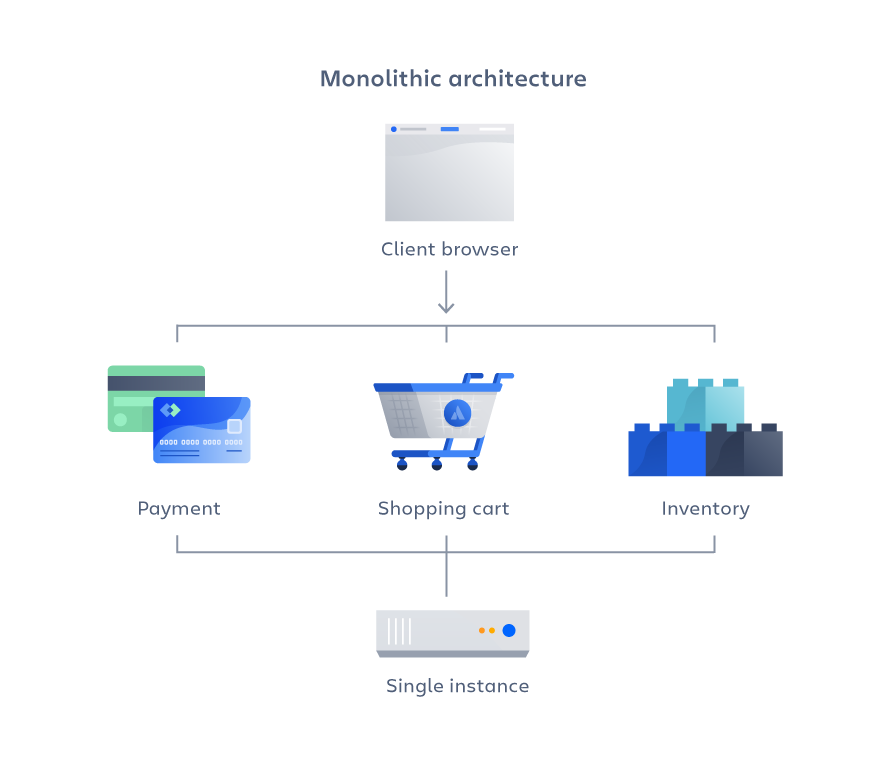
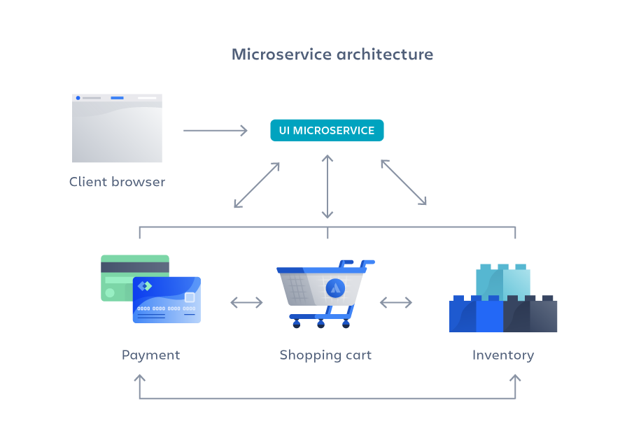
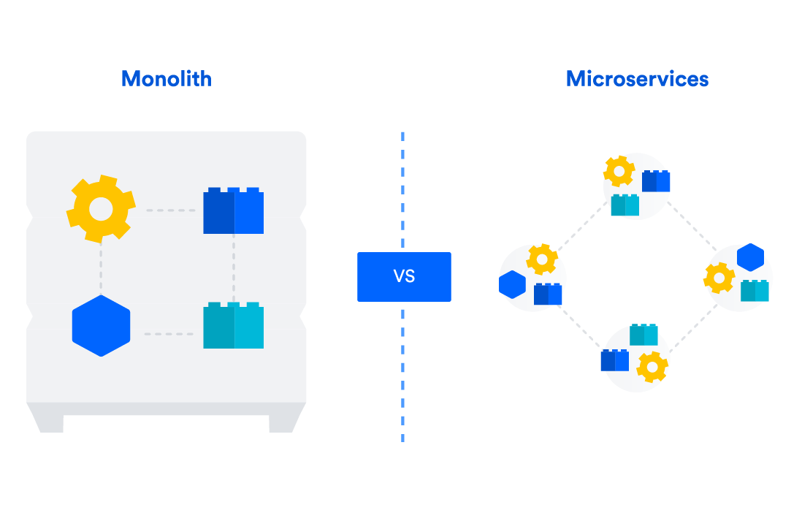

### React Episode Six Notes

# React Food Ordering Application :

# Q&A:

- # Q: Microservices vs. monolithic architecture:

  - Ans: "When monoliths grow too big it may be time to transition to microservices"

  A monolithic application is built as a single unified unit while a microservices architecture is a collection of smaller, independently deployable services. Which one is right for you? It depends on a number of factors.

  In 2009 Netflix faced growing pains. Its infrastructure couldn’t keep up with the demand for its rapidly growing video streaming services. The company decided to migrate its IT infrastructure from its private data centers to a public cloud and replace its monolithic architecture with a microservices architecture. The only problem was, the term “microservices” didn’t exist and the structure wasn’t well-known.

  Netflix became one of the first high-profile companies to successfully migrate from a monolith to a cloud-based microservices architecture. It won the 2015 JAX Special Jury award in part due to this new infrastructure that internalized DevOps. Today, Netflix has more than a thousand microservices that manage and support separate parts of the platform, while its engineers deploy code frequently, sometimes thousands of times each day.

  Netflix was an early pioneer in what has become increasingly common today: transitioning from a monolith architecture to a microservices architecture.

- # Q: What is a monolithic architecture?

  - Ans: A monolithic architecture is a traditional model of a software program, which is built as a unified unit that is self-contained and independent from other applications. The word “monolith” is often attributed to something large and glacial, which isn’t far from the truth of a monolith architecture for software design. A monolithic architecture is a singular, large computing network with one code base that couples all of the business concerns together. To make a change to this sort of application requires updating the entire stack by accessing the code base and building and deploying an updated version of the service-side interface. This makes updates restrictive and time-consuming.

  Monoliths can be convenient early on in a project's life for ease of code management, cognitive overhead, and deployment. This allows everything in the monolith to be released at once.

  

- # Q: Advantages of a monolithic architecture:

  - Ans: Organizations can benefit from either a monolithic or microservices architecture, depending on a number of different factors. When developing using a monolithic architecture, the primary advantage is fast development speed due to the simplicity of having an application based on one code base.

  `The advantages of a monolithic architecture include:`

  `Easy deployment` – One executable file or directory makes deployment easier.

  `Development` – When an application is built with one code base, it is easier to develop.

  `Performance` – In a centralized code base and repository, one API can often perform the same function that numerous APIs perform with microservices.

  `Simplified testing` – Since a monolithic application is a single, centralized unit, end-to-end testing can be performed faster than with a distributed application.

  `Easy debugging` – With all code located in one place, it’s easier to follow a request and find an issue.

- # Q: Disadvantages of a monolithic architecture:

  - Ans:
    As with the case of Netflix, monolithic applications can be quite effective until they grow too large and scaling becomes a challenge. Making a small change in a single function requires compiling and testing the entire platform, which goes against the agile approach today’s developers favor.

  `The disadvantages of a monolith include:`

  `Slower development speed` – A large, monolithic application makes development more complex and slower.

  `Scalability` – You can’t scale individual components.

  `Reliability` – If there’s an error in any module, it could affect the entire application’s availability.

  `Barrier to technology adoption` – Any changes in the framework or language affects the entire application, making changes often expensive and time-consuming.

  `Lack of flexibility` – A monolith is constrained by the technologies already used in the monolith.

  `Deployment` – A small change to a monolithic application requires the redeployment of the entire monolith.

- # Q: What is a microservices architecture?

  - Ans: A microservices architecture, also simply known as microservices, is an architectural method that relies on a series of independently deployable services. These services have their own business logic and database with a specific goal. Updating, testing, deployment, and scaling occur within each service. Microservices decouple major business, domain-specific concerns into separate, independent code bases. Microservices don’t reduce complexity, but they make any complexity visible and more manageable by separating tasks into smaller processes that function independently of each other and contribute to the overall whole.

  Adopting microservices often goes hand in hand with DevOps, since they are the basis for continuous delivery practices that allow teams to adapt quickly to user requirements.

  

- # Q: Advantages of a microservices architecture:

  - Ans: Microservices are by no means a silver bullet, but they solve a number of problems for growing software and companies. Since a microservices architecture consists of units that run independently, each service can be developed, updated, deployed, and scaled without affecting the other services. Software updates can be performed more frequently, with improved reliability, uptime, and performance. We went from pushing updates once a week, to two to three times a day.

  The benefits includes increased deployment speed, disaster recovery, reduced cost, and higher performance. This allows us to get to our target faster while delivering more incremental value to customers along the way.

  Plus, more generally, microservices make it easier for teams to update code and accelerate release cycles with continuous integration and continuous delivery (CI/CD). Teams can experiment with code and roll back if something goes wrong.

  `In short, the advantages of microservices are: `

  `Agility` – Promote agile ways of working with small teams that deploy frequently.

  `Flexible scaling` – If a microservice reaches its load capacity, new instances of that service can rapidly be deployed to the accompanying cluster to help relieve pressure. We are now multi-tenanant and stateless with customers spread across multiple instances. Now we can support much larger instance sizes.

  `Continuous deployment` – We now have frequent and faster release cycles. Before we would push out updates once a week and now we can do so about two to three times a day.

  `Highly maintainable and testable` – Teams can experiment with new features and roll back if something doesn’t work. This makes it easier to update code and accelerates time-to-market for new features. Plus, it is easy to isolate and fix faults and bugs in individual services.

  `Independently deployable` – Since microservices are individual units they allow for fast and easy independent deployment of individual features.

  `Technology flexibility` – Microservice architectures allow teams the freedom to select the tools they desire.

  `High reliability` – You can deploy changes for a specific service, without the threat of bringing down the entire application.

- # Q: Disadvantages of a microservices architecture:

  - Ans:
    When we moved from a small number of monolithic codebases to many more distributed systems and services powering our products, unintended complexity arose. We initially struggled to add new capabilities with the same velocity and confidence as we had done in the past. Microservices can add increased complexity that leads to development sprawl, or rapid and unmanaged growth. It can be challenging to determine how different components relate to each other, who owns a particular software component, or how to avoid interfering with dependent components.

  `The disadvantages of microservices can include:`

  `Development sprawl` – Microservices add more complexity compared to a monolith architecture, since there are more services in more places created by multiple teams. If development sprawl isn’t properly managed, it results in slower development speed and poor operational performance.

  `Exponential infrastructure costs` – Each new microservice can have its own cost for test suite, deployment playbooks, hosting infrastructure, monitoring tools, and more.

  `Added organizational overhead` – Teams need to add another level of communication and collaboration to coordinate updates and interfaces.

  `Debugging challenges` – Each microservice has its own set of logs, which makes debugging more complicated. Plus, a single business process can run across multiple machines, further complicating debugging.

  `Lack of standardization` – Without a common platform, there can be a proliferation of languages, logging standards, and monitoring.

  `Lack of clear ownership` – As more services are introduced, so are the number of teams running those services. Over time it becomes difficult to know the available services a team can leverage and who to contact for support.

  

- # Q: What's the difference between monolithic and microservices architecture?

  - Ans:

  A monolithic architecture is a traditional software development model that uses one code base to perform multiple business functions. All the software components in a monolithic system are interdependent due to the data exchange mechanisms within the system. It’s restrictive and time-consuming to modify monolithic architecture as small changes impact large areas of the code base. In contrast, microservices are an architectural approach that composes software into small independent components or services. Each service performs a single function and communicates with other services through a well-defined interface. Because they run independently, you can update, modify, deploy, or scale each service as required.

  `Key differences: monolithic vs. microservices:`

  Monolithic applications typically consist of a client-side UI, a database, and a server-side application. Developers build all of these modules on a single code base.

  On the other hand, in a distributed architecture, each microservice works to accomplish a single feature or business logic. Instead of exchanging data within the same code base, microservices communicate with an API.

  

- # Q: What is a microservices architecture?

  - Ans:

  Microservices help you innovate faster, reduce risk, accelerate time to market, and decrease your total cost of ownership. Here’s a summary of operational benefits of microservice architecture.

  `Innovate faster`
  Monolithic architecture limits an organization's ability to introduce new business capabilities and technologies in existing applications. Developers cannot rebuild certain parts of the code base with new technological frameworks, which delays your organization in adopting modern technological trends.

  Meanwhile, microservices are independent software components that developers can build with different frameworks and software technologies. The loose coupling between microservices allows businesses to innovate certain components more quickly.

  `Reduce risks`
  Both monolithic and microservices applications experience code conflict, bugs, and unsuccessful updates. However, a monolithic application carries a more significant risk when developers release new updates, as the entire application presents a single point of failure. A minor error in the code base can cause the whole application to fail. Such incidents have the potential to cause severe service outages and affect all active users.

  As such, developers prefer building microservices applications to mitigate deployment risks. If a microservice fails, other microservices remain operational, which limits the impact on the application. Developers also use tools to preempt and fix issues impacting microservices to improve the application's recoverability.

  `Accelerate time to market`
  Software development effort for monolithic applications increases exponentially as code complexity grows. Eventually, developers have to spend more time to manage and cross-reference code files and libraries at the cost of building new features. When you develop with a rigid infrastructure, it creates delays to the anticipated timeline.

  Conversely, organizations with microservices expertise can build and release digital products faster. In a distributed software architecture, each developer focuses on a smaller chunk of code instead of a large one. When developers create a specific microservice, they don't need to understand how other microservices work. They only need to use the appropriate APIs, which are faster and easier to learn.

  `Reduce total cost of ownership`
  Both microservices and monolithic applications incur expenses during development, deployment, and maintenance. However, the microservice approach is more cost-effective in the long term.

  You can scale microservice applications horizontally by adding compute resources on demand. You only have to add resources for the individual service, not the entire application. To scale monolithic systems, companies must upgrade memory and processing power for the application as a whole, which is more expensive.

  Besides infrastructure costs, the expenses of maintaining monolithic applications also increase with evolving requirements. For example, sometimes developers must run legacy monolithic software on newer hardware. This requires custom knowledge, and developers must rebuild the application so that it remains operational. Meanwhile, microservices run independently of specific hardware and platforms, which saves organizations from costly upgrades.

- # Q: When to use monolithic vs. microservices architecture

  - Ans:
    Both monolithic and microservices architecture help developers to build applications with different approaches. It's important to understand that microservices don't reduce the complexity of an application. Instead, the microservices structure reveals underlying complexities and allows developers to build, manage, and scale large applications more efficiently.

  When you decide between developing a microservices or monolithic architecture, you can consider the following factors.

  `Application size`
  The monolithic approach is more suitable when designing a simple application or prototype. Because monolithic applications use a single code base and framework, developers can build the software without integrating multiple services. Microservice applications may require substantial time and design effort, which doesn't justify the cost and benefit of very small projects.

  Meanwhile, microservices architecture is better for building a complex system. It provides a robust programming foundation for your team and supports their ability to add more features flexibly. For example, Netflix uses AWS Lambda to scale its streaming infrastructure and save development time.

  `Team competency`
  Despite its flexibility, developing with microservices requires a different knowledge set and design thinking. Unlike monolithic applications, microservices development needs an understanding of cloud architecture, APIs, containerization, and other expertise specific to modern cloud applications. Furthermore, troubleshooting microservices may be challenging for developers new to the distributed architecture.

  `Infrastructure`
  A monolithic application runs on a single server, but microservices applications benefit more from the cloud environment. While it's possible to run microservices from a single server, developers typically host microservices with cloud service providers to help ensure scalability, fault tolerance, and high availability.

  You need the right infrastructure in place before you can start with microservices. You require more effort to set up the tools and workflow for microservices, but they are preferable for building a complex and scalable application.

- # Q: Summary of differences: monolithic vs. microservices:

  | Category     | Monolithic architecture                                                                                           | Microservices architecture                                                                                                                                           |
  | ------------ | ----------------------------------------------------------------------------------------------------------------- | -------------------------------------------------------------------------------------------------------------------------------------------------------------------- |
  | Design       | Single code base with multiple interdependent functions.                                                          | Independent software components with autonomous functionality that communicate with each other using APIs.                                                           |
  | Development  | Requires less planning at the start, but gets increasingly complex to understand and maintain.                    | Requires more planning and infrastructure at the start, but gets easier to manage and maintain over time.                                                            |
  | Deployment   | Entire application deployed as a single entity.                                                                   | Every microservice is an independent software entity that requires individual containerized deployment.                                                              |
  | Debugging    | Trace the code path in the same environment.                                                                      | Requires advanced debugging tools to trace the data exchange between multiple microservices.                                                                         |
  | Modification | Small changes introduce greater risks as they impact the entire code base.                                        | You can modify individual microservices without impacting the entire application.                                                                                    |
  | Scale        | You have to scale the entire application, even if only certain functional areas experience an increase in demand. | You can scale individual microservices as required, which saves overall scaling costs.                                                                               |
  | Investment   | Low upfront investment at the cost of increased ongoing and maintenance efforts.                                  | Additional time and cost investment to set up the required infrastructure and build team competency. However, long-term cost savings, maintenance, and adaptability. |
